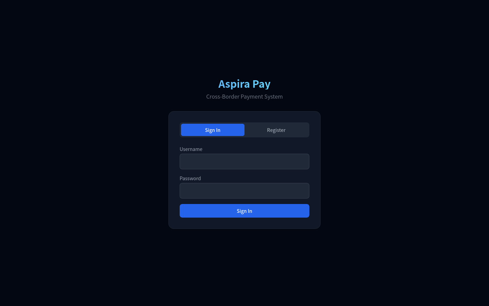
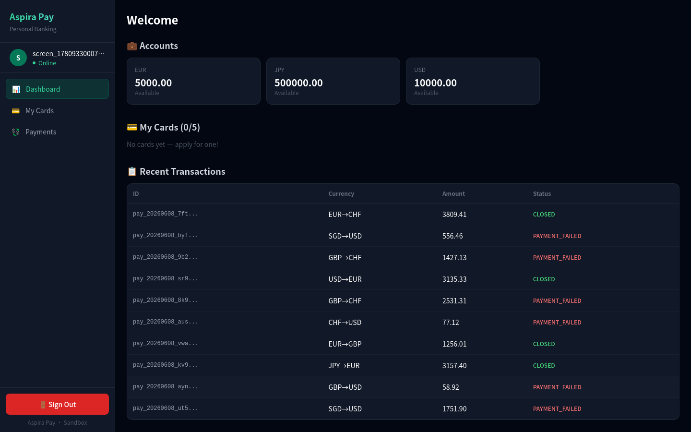
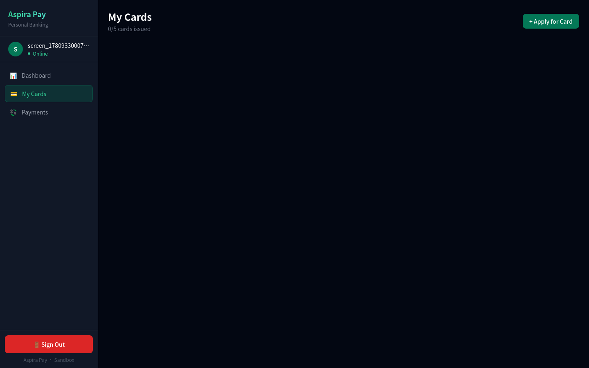
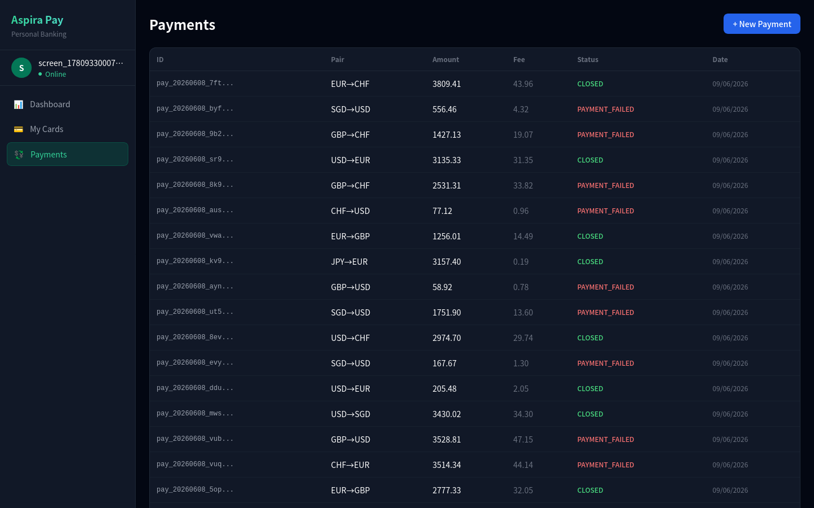
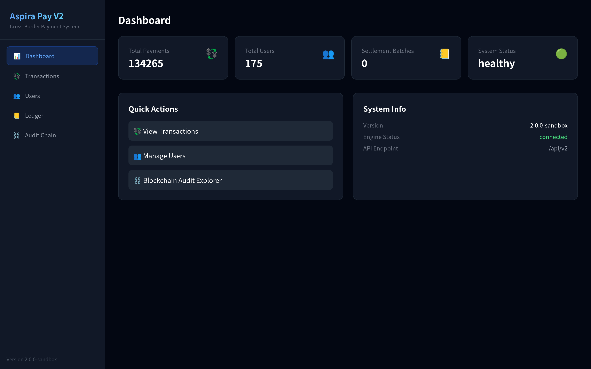
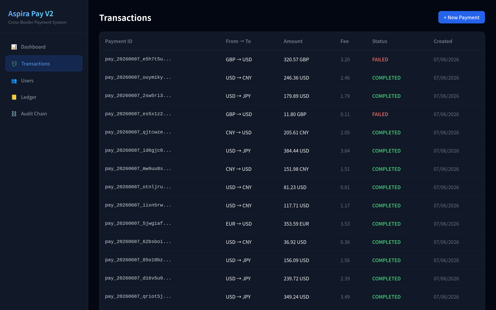
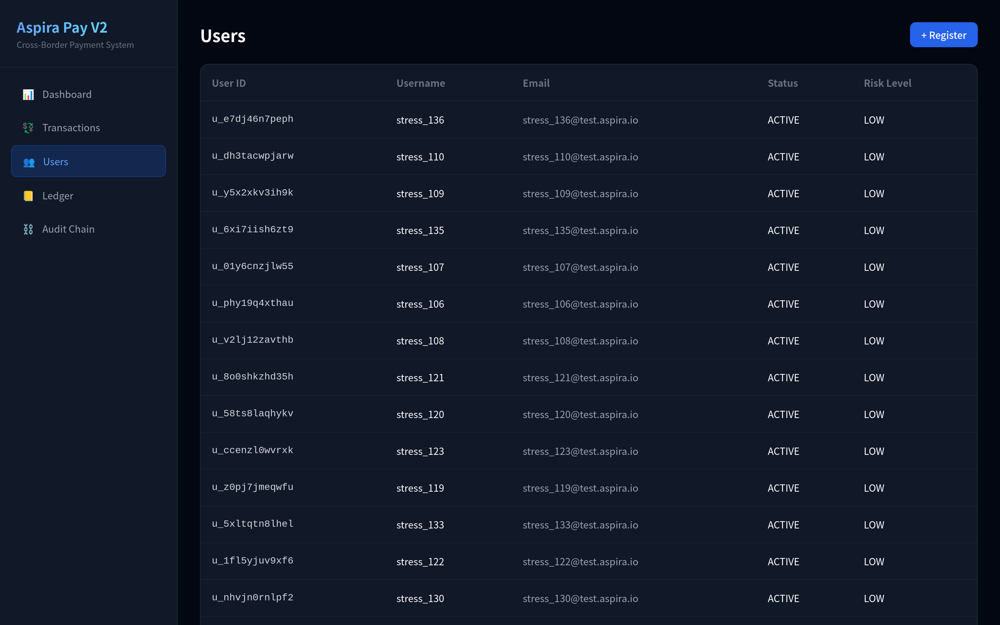
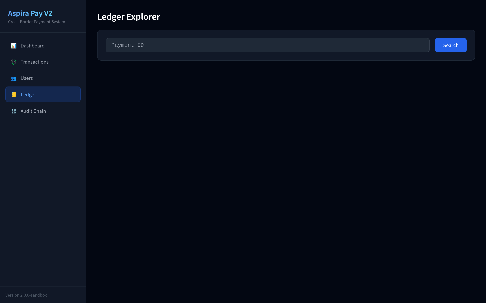
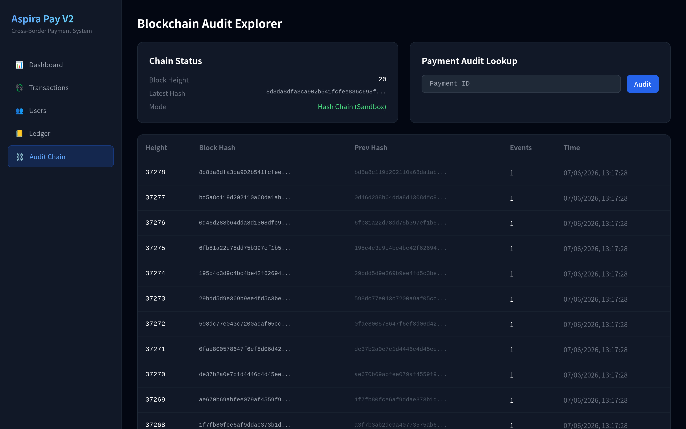

# Aspira Pay — Cross-Border Payment, Clearing & Card System

> Version: V3.0 Sandbox / Production-Ready Architecture
> Tech Stack: Go + C++20 + TypeScript + PostgreSQL + NATS + Redis + Blockchain

## System Overview

Aspira Pay is a Wise-like cross-border payment and multi-currency account system. It supports personal banking, virtual card management, FX conversion, clearing, settlement, and blockchain audit — all in a single unified platform.

Core Architecture:
- **Go** — Payment orchestration, KYC, risk control, card management, settlement, API gateway
- **C++20** — High-performance trading & clearing engine (FX, fee, ledger, WAL, Merkle)
- **TypeScript + React** — Admin console and personal banking web interface
- **PostgreSQL** — Business ledger, double-entry bookkeeping, account balances
- **NATS JetStream** — Event-driven message queue
- **Redis** — Caching, rate limiting
- **Blockchain (Hash Chain + Merkle Tree + Ed25519)** — Tamper-proof audit proofs

## Project Structure

```
aspira-pay/
├── backend-go/          # Go API monolith (all modules)
│   ├── cmd/             # server, bench-client, stress-test, full-stress
│   ├── internal/        # domain, repository, service, transport, middleware
│   └── pkg/             # crypto, idgen, card/luhn, errors
├── engine-cpp/          # C++ trading engine (6 threads, SPSC, WAL checksum)
├── web-admin/           # React + TypeScript + Tailwind
│   └── src/
│       ├── pages/       # Admin: Dashboard, Transactions, Users, Ledger, Audit, Cards
│       │                # User:  Login, UserDashboard, UserCards, UserPayments
│       ├── components/  # Layout, UserLayout, StatsCard, ChainExplorer
│       └── hooks/       # usePolling
├── migrations/          # 16 PostgreSQL migration files
├── deploy/              # Docker Compose, Dockerfiles, Prometheus, scripts
├── docs/                # Architecture docs, screenshots, development issues
└── README.md
```

## Quick Start

### Prerequisites

- Go 1.22+
- CMake 3.16+ & C++20 compiler
- Docker & Docker Compose
- PostgreSQL 16+
- Node.js 18+

### Minimal Deployment

```bash
# 1. Start PostgreSQL
docker run -d --name aspira-pay-postgres -e POSTGRES_DB=aspirapay \
  -e POSTGRES_USER=aspirapay -e POSTGRES_PASSWORD=aspirapay_secret \
  -p 5432:5432 postgres:16-alpine

# 2. Run migrations
for f in migrations/*.sql; do
  docker exec -i aspira-pay-postgres psql -U aspirapay -d aspirapay < $f
done

# 3. Build & start API
cd backend-go && go build -o aspira-api ./cmd/server/ && ./aspira-api configs/config.yaml

# 4. Start frontend (dev mode)
cd web-admin && npm install && npx vite --port 3000 --host
```

Service Ports:
- **Web Interface**: `http://localhost:3000`
- **API Gateway**: `http://localhost:8080`
- **Health Check**: `http://localhost:8080/health`
- **Prometheus Metrics**: `http://localhost:8080/metrics`

## User Roles

| Role | Access | How to Get |
|------|--------|-----------|
| **Personal User** | Dashboard, Cards, Payments | Register without admin key |
| **Administrator** | Full admin panel (6 pages) + Audit logs | Register with `aspira-` prefix key, or login as `admin/admin123` |

## Web Interface Screenshots

### Personal Banking (User-Facing)

The personal banking interface provides a clean, dark-themed experience for everyday users — inspired by Wise's design language with emerald-green accents.

#### Login & Registration


The **Login page** supports both sign-in and registration. New users fill in KYC information (full name, nationality, date of birth) during registration. An optional **Admin Key** field (starting with `aspira-`) grants administrator privileges. Regular users leave this field blank.

#### User Dashboard


The **User Dashboard** shows multi-currency wallet balances (USD, EUR, JPY, etc.), active virtual cards with masked numbers (`•••• •••• •••• 4480`), and recent transaction history. All data auto-refreshes every 5 seconds.

#### My Cards


The **My Cards** page displays all issued cards as Wise-style gradient cards — VISA cards have an emerald-to-cyan gradient, Mastercard cards have an orange-to-yellow gradient. Each card shows the masked number, network, expiry date, and status. Users can apply for new cards (up to 5) with full KYC submission, or cancel existing cards. A **Spend Quote Calculator** lets users preview the exact cost before making a purchase — showing the FX rate, debit amount, and fee breakdown.


Once a card is issued, it appears in the card grid with action buttons for freeze/unfreeze and spending quotes.

#### Payments


The **Payments** page lets users send money across currencies. Select source and target currencies, enter an amount, and the system automatically calculates the FX rate and fee. All transactions are displayed in a real-time table with status tracking (CREATED → PAYMENT_PENDING → PAYMENT_EXECUTING → CLOSED).

### Admin Console (Administrator)

The admin dashboard provides full operational control with a blue-themed interface.

#### Dashboard


The **Admin Dashboard** gives an at-a-glance overview of the entire system — total payments, registered users, settlement batches, and system health status. Quick-action shortcuts provide fast navigation to core workflows.

#### Transactions


The **Transactions** page lists all cross-border payment orders with real-time status updates. Admins can create new payments and monitor the full lifecycle from CREATED to CLOSED.

#### Users


The **Users** page manages all registered participants. The table displays user ID, username, email, account status, and risk level for compliance review.

#### Ledger Explorer


The **Ledger Explorer** provides double-entry bookkeeping transparency. Enter a Payment ID to retrieve full debit/credit entries and verify that totals balance.

#### Blockchain Audit


The **Blockchain Audit Explorer** visualises the tamper-proof hash chain. Each block links to its predecessor via cryptographic hashes with Merkle proofs for independent verification.

## API Base Path

```
Base URL: http://localhost:8080/api/v2
```

### Key Endpoints

| Method | Path | Description |
|--------|------|-------------|
| `POST` | `/auth/register` | Register with KYC data |
| `POST` | `/auth/login` | Login (returns JWT + is_admin) |
| `GET` | `/users/me` | Current user profile |
| `POST` | `/payments` | Create cross-border payment |
| `GET` | `/payments` | List payments |
| `POST` | `/cards/virtual` | Issue virtual card (admin) |
| `POST` | `/cards/apply` | Apply for card with KYC |
| `GET` | `/cards` | List my cards |
| `POST` | `/cards/:id/quote-spend` | Fee estimate before purchase |
| `POST` | `/cards/:id/freeze` | Freeze a card |
| `POST` | `/cards/:id/cancel` | Cancel a card |
| `GET` | `/accounts` | Multi-currency balances |
| `GET` | `/chain/blocks` | Blockchain audit blocks |
| `GET` | `/chain/verify/:payment_id` | Merkle proof verification |
| `GET` | `/admin/dashboard` | Admin dashboard stats |
| `GET` | `/admin/v2/audit-logs` | Admin operation audit log |
| `POST` | `/admin/v2/review-card` | Review card application |

## Key Technical Principles

1. All monetary amounts use int64 (smallest currency unit)
2. All transaction endpoints must be idempotent
3. The ledger is append-only — no deletions, reversals via opposite entries
4. Every transaction follows a strict 16-state machine
5. The C++ engine handles high-performance execution; Go handles business orchestration
6. Local ledger finality first; on-chain confirmation follows with eventual consistency
7. Sensitive data (full PAN, CVV, PIN) never stored on-chain or in plaintext
8. All admin operations are audit-logged with actor, action, target, and timestamp
9. Cards use tokenization — only `card_token` + `last4` stored; full PAN never persisted
10. Fee model is transparent (Wise-like): users see total cost before confirming payment

## Stress Test Results

| Metric | Value (50 accounts, 20 workers, 30s) |
|--------|--------------------------------------|
| Total Transactions | 17,658 |
| Successful | 4,062 (23%) |
| Throughput | 589 TPS |
| P50 Latency | 46ms |
| P95 Latency | 89ms |
| P99 Latency | 125ms |

Run with: `go run cmd/full-stress/main.go -accounts=500 -duration=120 -workers=50`

## Architecture Versions

| Feature | V2 | V3 |
|---------|-----|-----|
| User Roles | Personal + Admin | + Business + 4 Admin tiers |
| Auth | admin_key prefix | RBAC + ABAC |
| Payment States | 12 states | 16 states |
| Ledger | Double-entry | + Voucher system + 8 account types |
| Settlement | 4 batch statuses | 9 batch statuses |
| Reconciliation | Internal only | 3-way (internal + channel + chain) |
| C++ Engine | Single engine | 7 sub-engines + gRPC |
| Blockchain | None | Hash Chain + Merkle + Ed25519 |
| Deployment | Docker Compose | Kubernetes + HA |

See [development-issues.md](docs/development-issues.md) §17 for full comparison.

## License

Proprietary — Aspira Studio
